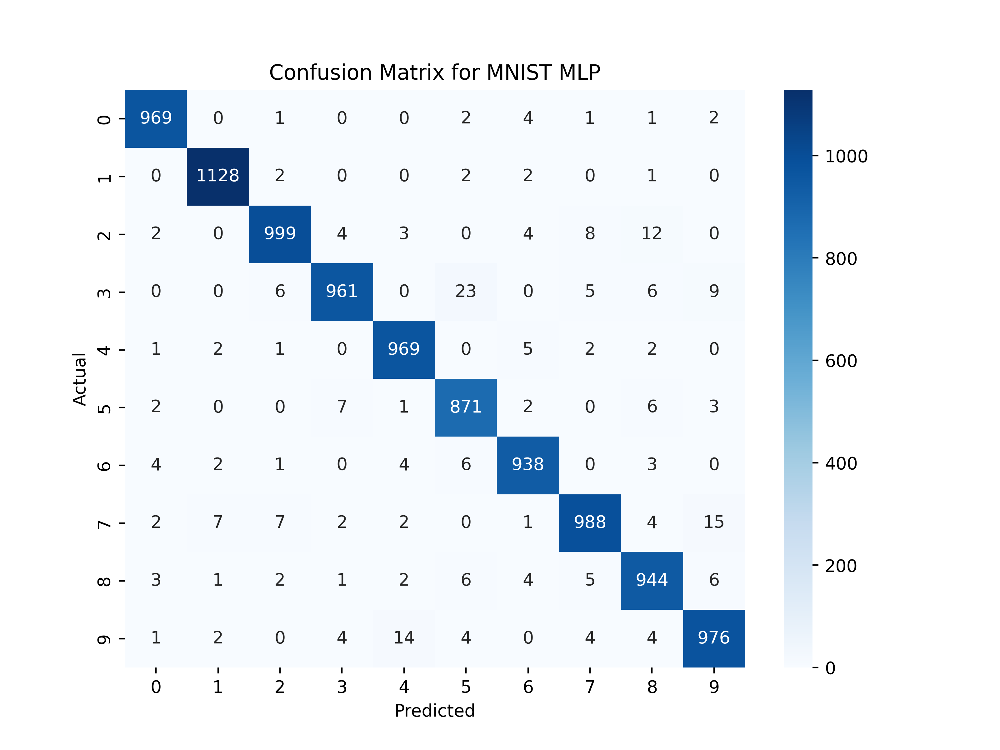

# MNIST Classification: MLP Vs CNN

This project demonstrates handwritten digit classification using two architectures, namely:

1) **Multi-Layer Perceptron (MLP)**: This is just for our baseline
2) **Convolutional Neural Network**: This is our main model

The goal of this project is to compare the performance between these two architectures.

## Folder Structure

This project is organized as follows:
```
MNIST/
├── models/ # MLP and CNN model definitions
├── trainers/ # Training scripts for both models
├── utils/ # Data loader, evaluation utilities
├── cm/ # Confusion matrix plots (final results)
├── README.md
├── runs # This runs the specific model training
├── requirements.txt
└── .gitignore
```
## Setup Instructions
1) Clone the repo using the following command
```
git clone https://github.com/samueldereje96/MNIST.git
cd MNIST
```
2) Create a virtual environment
```
python -m venv env # it could be venv or the name of your choice
# If your OS is Windows
env\Scripts\activate
# If you are using Linux
source env/bin/activate
```
3) Then install the `requirements.txt` using
```
python -m pip install -r requirements.txt
```
4) Install PyTorch based on your system. For this repo, the Torch version is 2.10 and it works for CUDA 13

## Training and Evaluation

To train the models, use the following commands:
```
python -m runs.runMLP # for the MLP
python -m runs.runCNN # for the CNN
```
Both scripts run the training and evaluation and the confusion matirx is finally stored at the `cm` directory. Here are the comparisons between the two models



# Future Works
- Include inference
- Add a React-based user interface that has a Python backend

# References
- PyTorch Documentation
- MNIST Dataset
- Scikit Learn Documentation
- Seaborn and Matplotlib documentation
